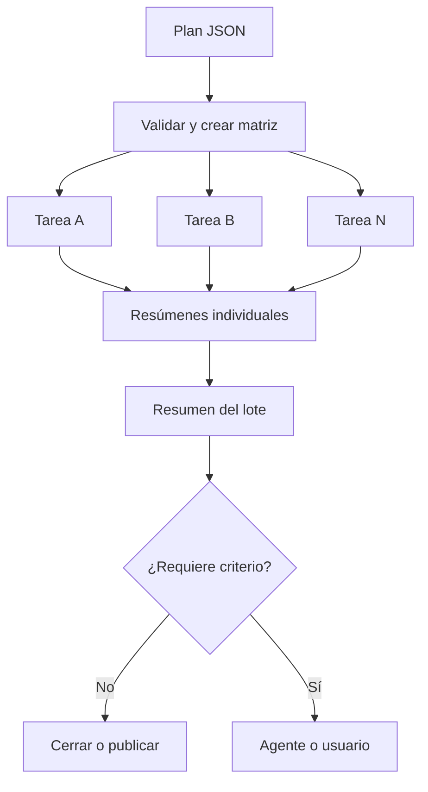
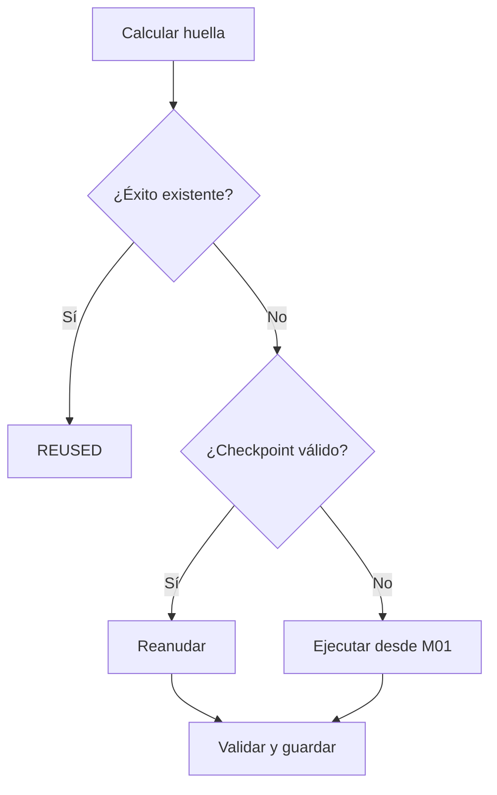

# G10 por dentro: guía de bajo nivel

**Versión:** 1.0.0 · **Fecha:** 12-09-2026  
**Código descrito:** `main` después de los PR #6 y #7

## 1. El problema

G10 separa dos trabajos que antes se confundían:

- GitHub ejecuta, espera, conserva logs y reúne resultados.
- El agente analiza únicamente fallos nuevos o decisiones no programables.

La conversación deja de ser la memoria del proyecto. La unidad persistente es una
**tarea identificada, presupuestada y con contrato de éxito**.



## 2. Estado exacto

### Ya está activo

- `G10 — Control de lote` se ejecuta en cambios del framework y manualmente.
- Valida un plan JSON antes de crear runners caros.
- Convierte las tareas en una matriz con hasta cuatro jobs simultáneos.
- Usa `fail-fast: false`: una tarea fallida no cancela las demás.
- Cada tarea guarda su log, código de salida y resumen.
- El agregador se ejecuta con `if: always()`.
- Hay seis tests para huellas, admisión, presupuesto, clasificación, reintentos,
  anti-bucle y agregación.

### Existe en Python, pero aún no está conectado al workflow completo

- Huella real de código, configuración, fuentes y contexto.
- Admisión por dependencias, presupuesto, ejecución activa y éxito anterior.
- Decisión automática de reintento.
- Protección contra repetir la misma decisión para la misma huella.

### Todavía pendiente

- Persistir estado entre runs.
- Buscar un éxito anterior por huella y omitir el cálculo.
- Guardar y restaurar checkpoints M01–M06.
- Ejecutar automáticamente los reintentos.
- Activar `territory_m01_m06`.
- Abrir incidencias y llamar a un Workspace Agent.
- Publicar productos canónicos desde G10.

El smoke escribe actualmente una huella de 64 ceros. Es un marcador visible, no
una huella real. La acción territorial también falla deliberadamente para impedir
que una prueba lance por accidente un cálculo pesado.

## 3. Componentes

```text
g10/
  __init__.py                     interfaz pública
  core.py                         reglas del orquestador
herramientas/
  g10_orquestar.py                CLI
orchestracion/
  plan_lote_g10_smoke.json        plan pequeño de CI
schemas/
  g10-plan-lote.schema.json       formato del plan
  g10-resumen-maquina.schema.json formato del resultado
tests/
  test_g10_orquestacion.py        tests rápidos
.github/workflows/
  g10-control.yml                 conexión con GitHub Actions
```

`core.py` no conoce GitHub: recibe datos y devuelve decisiones.
`g10_orquestar.py` traduce órdenes de terminal. El YAML conecta esas órdenes
con runners. Por eso la lógica se prueba en milisegundos sin GIS.

## 4. El plan de lote

Cabecera:

```json
{
  "$schema": "../schemas/g10-plan-lote.schema.json",
  "schema_version": "1.0",
  "lot_id": "g10-smoke-v1"
}
```

- `$schema`: localiza la definición formal.
- `schema_version`: impide interpretar silenciosamente formatos antiguos.
- `lot_id`: identifica la intención; no es el número de run de GitHub.

Presupuesto:

```json
"budget": {
  "runner_minutes": 30,
  "max_parallel": 4,
  "max_agent_cycles_per_fingerprint": 1
}
```

Hoy se valida el presupuesto, pero el workflow todavía no descuenta minutos
reales y tiene `max-parallel: 4` escrito directamente.

Tarea:

```json
{
  "task_id": "validar-config-aragon",
  "territory": "aragon",
  "stage": "CONTRACT",
  "depends_on": [],
  "priority": "blocking",
  "max_attempts": 1,
  "timeout_minutes": 10,
  "estimated_runner_minutes": 1,
  "requires_agent_on_failure": true,
  "success_contract": "CONTRATO_TERRITORIO.md",
  "action": "validate_config",
  "config": "territorios/aragon/config/aragon_2025.yaml"
}
```

| Campo | Significado |
|---|---|
| `task_id` | Identidad lógica única dentro del plan. |
| `territory` | Territorio o `sintetico`. |
| `stage` | Fase conceptual: CONTROL, CONTRACT, M05, EXPORT… |
| `depends_on` | Dependencias; el núcleo las entiende, la matriz aún no agenda rondas. |
| `priority` | Importancia; aún no altera el orden del runner. |
| `max_attempts` | Límite lógico; aún no relanza jobs. |
| `timeout_minutes` | Límite previsto; aún no se proyecta dinámicamente. |
| `estimated_runner_minutes` | Coste usado por la admisión. |
| `requires_agent_on_failure` | Señala si hay que preparar revisión. |
| `success_contract` | Define qué debe cumplirse. |
| `action` | Acción de una lista cerrada, no shell arbitrario. |
| `config` | YAML territorial. |

## 5. Validación

```bash
python herramientas/g10_orquestar.py validate-plan \
  --plan orchestracion/plan_lote_g10_smoke.json
```

`validate_plan()` comprueba versión, ID del lote, presupuesto, paralelismo,
lista no vacía, tipos, IDs duplicados, acciones permitidas, números negativos,
dependencias inexistentes y autodependencias.

Acciones permitidas:

```python
{"g10_selftest", "validate_config", "territory_m01_m06"}
```

El workflow usa esta lista como catálogo. No ejecuta el valor de `action` como
una orden arbitraria. Los JSON Schema documentan el contrato, aunque la CI aún
usa el validador Python y no una biblioteca JSON Schema externa.

## 6. De JSON a matriz

```bash
python herramientas/g10_orquestar.py matrix \
  --plan orchestracion/plan_lote_g10_smoke.json
```

produce una línea con `{"include":[...]}`. GitHub la escribe en
`$GITHUB_OUTPUT` y la recupera con:

```yaml
matrix: ${{ fromJSON(needs.planificar.outputs.matrix) }}
```

Cada elemento de `include` crea un job distinto y recibe sus propios valores
`matrix.task_id`, `matrix.territory`, `matrix.action` y `matrix.config`.

## 7. El workflow paso a paso

### Disparo

Se activa en pull requests y pushes a `main` que cambien el framework. También
admite ejecución manual. Los disparos automáticos usan el plan smoke.

### `planificar`

1. Hace checkout.
2. Valida el plan.
3. Construye la matriz.
4. La entrega al siguiente job.

Un plan inválido falla antes de construir Docker o ejecutar GIS.

### `ejecutar`

```yaml
strategy:
  fail-fast: false
  max-parallel: 4
```

Son hasta cuatro runners separados, no cuatro hilos. El fallo de uno no cancela
los demás.

El despacho es un `case` seguro:

```bash
case "$ACTION" in
  g10_selftest) ... ;;
  validate_config) ... ;;
  territory_m01_m06) ... ;;
  *) ... ;;
esac
```

- `g10_selftest`: ejecuta los seis tests.
- `validate_config`: construye Docker, carga el YAML y llama a
  `hard_limits()` para comprobar K y los tres ratios obligatorios. No ejecuta
  M01–M06 ni crea un GeoJSON.
- `territory_m01_m06`: bloqueo deliberado hasta disponer de huellas y
  checkpoints reales.

El código de salida Unix es `0` para éxito y distinto de cero para fallo. Se
guarda en:

```text
g10-out/<task_id>/exit_code
g10-out/<task_id>/task.log
g10-out/<task_id>/build.log
```

### Resumen individual

`if: always()` obliga a generar `resumen.json` aunque la tarea falle.
El clasificador recibe código, log y etapa. Hoy un fallo del job se refleja como
`REQUIRES_AGENT`; la política automática de reintentos aún no está cableada.

Cada tarea publica un artefacto legible:

```text
g10-<task_id>
```

### `resumir`

También usa `if: always()`. Descarga los artefactos `g10-*`, localiza los
`resumen.json`, los ordena y produce:

```text
RESUMEN_LOTE_G10.json
g10-resumen-lote-<run_id>
```

## 8. Los dos primeros runs reales

En el run 1, el autocontrol pasó y la validación de Aragón falló porque el smoke
buscaba `expected_population_total_2025`, campo que Aragón no declara. La otra
tarea no fue cancelada y el agregador conservó ambos resultados.

Se corrigió el smoke para obtener K de `territory_contract` y validar los ratios
sin exigir esa población. En el run 2 pasaron el controlador G10, sus dos tareas,
el agregador y la suite general DDD.

Esto prueba independencia y agregación ante un fallo. No prueba todavía
deduplicación territorial.

## 9. Huellas

`compute_fingerprint()` usa SHA-256:

1. añade `DDD-G10-v1\0`;
2. serializa el contexto con claves ordenadas;
3. elimina rutas repetidas y las ordena;
4. impide acceder fuera de la raíz;
5. incorpora el nombre relativo;
6. lee en bloques de 1 MiB;
7. devuelve `sha256:<64 hexadecimales>`.

El orden de los archivos no cambia la huella; modificar un byte sí. La huella
territorial deberá incluir módulos, núcleo, YAML, checksums de fuentes, digest
Docker y parámetros.

## 10. Admisión

`decide_admission()` evalúa, por este orden:

1. dependencias pendientes;
2. decisión humana pendiente;
3. éxito previo con la misma huella;
4. ejecución idéntica activa;
5. presupuesto;
6. admisión.

Puede devolver `WAITING_DEPENDENCY`, `BLOCKED_DECISION`, `REUSED`,
`REJECTED_BUDGET` o `ADMITTED`. Reutilizar se comprueba antes que el
presupuesto porque no consume el coste estimado.

## 11. Clasificación de fallos

| Clase | Señales |
|---|---|
| `TIMEOUT` | timeout o deadline |
| `TRANSIENT_NETWORK` | reset, fallo temporal, 503 o rate limit |
| `RUNNER_FAILURE` | apagado o pérdida del runner |
| `INVALID_INPUT` | fichero ausente o checksum erróneo |
| `REGRESSION` | baseline, regresión o trinquete |
| `TOPOLOGY_BLOCK` | topología, no contiguo o nodo aislado |
| `PUBLISH_FAILURE` | Flourish, FeatureCollection, geometría o EXPORT |
| `CONTRACT_FAILURE` | aserción, contrato o invariante |
| `UNKNOWN` | ninguna señal conocida |

No usa IA. Busca patrones en orden. Si el código es cero devuelve éxito aunque
el log contenga una palabra histórica como «error».

## 12. Reintentos

El núcleo limita:

| Fallo | Máximo interno |
|---|---:|
| Red | 2 |
| Runner | 2 |
| Publicación | 2 |
| Timeout | 1 |

El máximo efectivo es el menor entre ese valor y `max_attempts`. Regresiones,
contratos, topología y fallos desconocidos requieren análisis; repetirlos sin
cambios produciría el mismo resultado.

## 13. Anti-bucle

`loop_guard()` cuenta la misma combinación:

```text
fingerprint + failure_class + decision
```

Si se alcanza el máximo, debe detenerse como `LOOP_GUARD`. Si cambia el código
o la configuración, cambia la huella y ya no es exactamente el mismo intento.

## 14. Agregación y escritura segura

`aggregate_summaries()` ordena por `task_id`, cuenta estados y construye
`requires_human`. El orden estable permite comparar runs concurrentes.

`atomic_write_json()` escribe primero un temporal y después usa
`os.replace()`. Una interrupción no debería dejar medio JSON en el destino.

## 15. Qué garantizan los tests

| Test | Garantía |
|---|---|
| Plan y duplicados | Una identidad no aparece dos veces. |
| Huella | El orden no influye; el contenido sí. |
| Admisión | Reutiliza éxitos y respeta presupuesto. |
| Clasificación | Reintenta un 503, escala una regresión. |
| Anti-bucle | Detecta una decisión repetida. |
| Agregación | No oculta bloqueos y mantiene orden. |

Son tests de control, no GIS. Deben fallar rápido antes de consumir una
regresión territorial.

## 16. Próxima conexión técnica

Para no repetir M01–M06 hacen falta cuatro conexiones reales:

1. calcular la huella antes del job;
2. buscar un manifiesto `SUCCESS` con esa huella;
3. guardar checkpoints con huellas y checksums;
4. restaurar el último checkpoint compatible.



Hasta que exista una prueba de aceptación en Actions no debe afirmarse que G10
deduplica una regresión territorial.

## 17. Futura llamada al agente

El paquete no enviará «continúa». Enviará:

```json
{
  "task_id": "producir-andalucia-2025",
  "fingerprint": "sha256:...",
  "attempt": 1,
  "failure_class": "TOPOLOGY_BLOCK",
  "failed_stage": "M03",
  "last_valid_checkpoint": "M02",
  "recommended_action": "REVIEW",
  "artifacts": ["task.log", "resumen.json", "manifiesto.json"]
}
```

Antes se aplicará `loop_guard()`. El agente devolverá una decisión cerrada:
`PATCH_CONFIG`, `PATCH_CODE`, `KEEP_BLOCKED` o
`REQUIRE_HUMAN_DECISION`.

## 18. Cómo inspeccionar un lote

1. Abrir `g10-resumen-lote-<run_id>`.
2. Leer `RESUMEN_LOTE_G10.json`.
3. Mirar `counts`.
4. Si todo es `SUCCESS` o `REUSED`, terminar.
5. Localizar únicamente el `task_id` fallido.
6. Abrir `g10-<task_id>`.
7. Leer `resumen.json` y solo entonces `task.log`.

Así no se abren decenas de logs verdes.

## 19. Glosario

| Término | Significado |
|---|---|
| Lote | Grupo de tareas con una intención común. |
| Tarea | Unidad aislada de trabajo. |
| Matriz | Crea varios jobs desde una definición. |
| Runner | Máquina temporal que ejecuta un job. |
| Artefacto | Archivos conservados al terminar. |
| Huella | SHA-256 de entradas y contexto. |
| Checkpoint | Resultado intermedio válido. |
| Contrato | Condiciones de aceptación. |
| Trinquete | Impide degradar un baseline. |
| Fallo transitorio | Puede desaparecer sin cambiar entradas. |
| Fallo determinista | Se repetirá con las mismas entradas. |
| Anti-bucle | Detiene la misma respuesta sin cambio real. |

## 20. Frase de estado

> G10 ya demuestra planificación, paralelismo independiente, clasificación
> básica y agregación real en GitHub. Todavía no demuestra deduplicación
> territorial persistente, reanudación M01–M06 ni llamada automática al agente.

Esta frase debe actualizarse solo cuando cada capacidad tenga una prueba de
aceptación en GitHub Actions.
